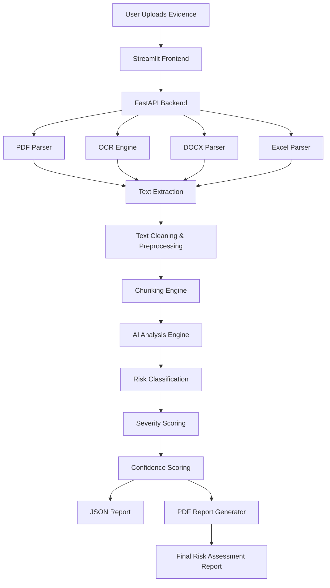
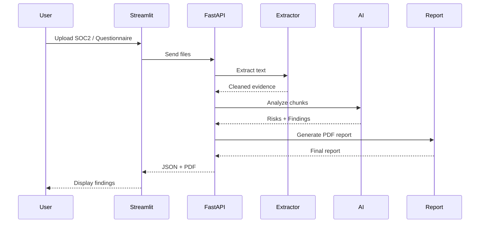
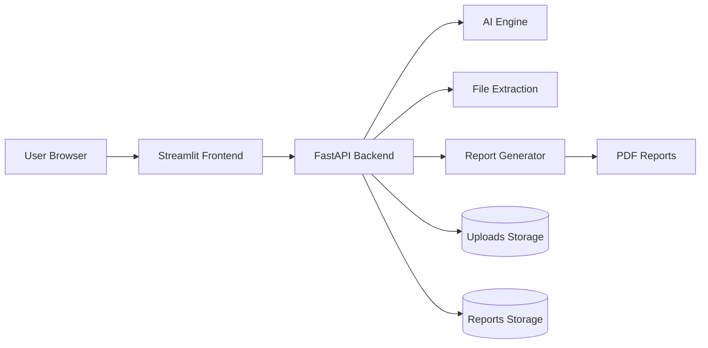

# AI-Powered TPRM Evidence Review Assistant

## Overview

The AI-Powered TPRM Evidence Review Assistant is a production-style cybersecurity assessment platform designed to automate preliminary vendor evidence review for Third-Party Risk Management (TPRM) workflows.

The system processes vendor evidence such as:

* SOC 2 reports
* Security questionnaires
* Security policies
* Audit documents
* Vendor compliance evidence

It extracts security-relevant information, identifies potential control gaps, classifies risks, generates recommendations, and produces structured cybersecurity assessment reports.

---

# Key Features

## Core Capabilities

* PDF / DOCX / XLSX upload
* OCR support for scanned PDFs
* AI-assisted cybersecurity evidence analysis
* Risk categorization engine
* Severity classification
* Confidence scoring
* Executive summary generation
* Human-readable PDF reports
* Streamlit demo dashboard
* FastAPI backend APIs
* Chunk-based document analysis
* Secure evidence-based assessment flow

---

# Business Problem

Traditional TPRM assessments are:

* Manual
* Time-consuming
* Repetitive
* Difficult to scale
* Prone to inconsistent analysis

Security analysts often review:

* SOC2 reports
* ISO evidence
* Vendor questionnaires
* DR/BCP documents
* Penetration test reports

This solution reduces manual effort by automating preliminary evidence review and identifying potential cybersecurity risks.

---

# Solution Objectives

The platform is designed to:

* Automate evidence extraction
* Detect potential control gaps
* Validate questionnaire responses
* Assist security analysts
* Improve consistency
* Reduce review time
* Generate structured audit-style findings

---

# Technology Stack

| Layer             | Technology           |
| ----------------- | -------------------- |
| Frontend          | Streamlit            |
| Backend API       | FastAPI              |
| AI Layer          | Groq LLM API         |
| OCR               | pytesseract          |
| PDF Parsing       | pdfplumber / PyMuPDF |
| DOCX Parsing      | python-docx          |
| Excel Parsing     | pandas + openpyxl    |
| Report Generation | reportlab            |
| Language          | Python               |

---

# Project Structure

```text
AI_TPRM_Evidence_Assist/
│
├── app.py
├── main.py
├── requirements.txt
├── README.md
│
├── extractor/
│   ├── pdf_parser.py
│   ├── ocr.py
│   ├── docx_parser.py
│   ├── excel_parser.py
│
├── ai_engine/
│   ├── analyzer.py
│   ├── prompt_templates.py
│
├── risk_engine/
│   ├── categorizer.py
│   ├── scorer.py
│
├── output/
│   ├── report_generator.py
│
├── utils/
│   ├── helpers.py
│
├── uploads/
├── reports/
├── data/
│   ├── frameworks.json
```

---

# System Architecture



---

# End-to-End Workflow



---

# Core Processing Pipeline

## Step 1 — File Upload

Supported file formats:

* PDF
* DOCX
* XLSX

The frontend accepts multiple files simultaneously.

---

## Step 2 — Evidence Extraction

### PDF Parsing

Uses:

* pdfplumber
* PyMuPDF

Capabilities:

* Extract machine-readable text
* Handle structured reports
* Read SOC2 evidence

---

### OCR Fallback

If PDF extraction fails:

* Convert pages to images
* Run OCR using pytesseract

This supports:

* scanned PDFs
* screenshots
* image-based evidence

---

### Excel Questionnaire Extraction

The Excel parser extracts:

* security questionnaire answers
* MFA responses
* encryption details
* monitoring responses
* DR/BCP answers

Security-focused keyword filtering is used to reduce token usage.

---

# AI Analysis Engine

The AI engine performs:

* evidence review
* gap identification
* risk analysis
* recommendation generation
* severity assignment

---

# Chunk-Based Analysis

Large evidence documents are processed using chunking.

Benefits:

* Prevents token overflow
* Preserves full evidence coverage
* Improves scalability
* Reduces model failures

---

# Risk Categories

The platform categorizes findings into:

| Category                 |
| ------------------------ |
| Access Control           |
| Data Protection          |
| Compliance               |
| Vulnerability Management |
| Incident Response        |
| Third-Party Risk         |
| Business Continuity      |
| Logging & Monitoring     |
| Governance               |

---

# Severity Classification

Potential findings are assigned:

| Severity |
| -------- |
| Critical |
| High     |
| Medium   |
| Low      |

Severity is based on:

* evidence quality
* control weakness
* governance gaps
* operational inconsistency

---

# Confidence Scoring

Confidence scores estimate:

* evidence reliability
* extraction quality
* AI certainty
* completeness of validation

Example:

```json
{
  "confidence": 88
}
```

---

# Example Risk Finding

```json
{
  "category": "Access Control",
  "risk": "Delayed privileged access review identified.",
  "severity": "Medium",
  "recommendation": "Implement automated quarterly access review workflows.",
  "confidence": 89
}
```

---

# Security Assessment Principles

The system follows safe cybersecurity reporting practices.

## The system NEVER says:

* "Vendor is insecure"
* "Confirmed breach"
* "Control failure confirmed"

## Instead it uses:

* "Potential Risk"
* "Missing Evidence"
* "Evidence could not verify"

---

# AI Safety Controls

The AI engine enforces:

* Evidence-only analysis
* Hallucination reduction
* Conservative wording
* Structured JSON outputs
* Deterministic processing

---

# API Architecture

## FastAPI Endpoint

### Analyze Evidence

```http
POST /analyze
```

### Input

Multipart file upload.

### Output

```json
{
  "analysis": {
    "summary": "...",
    "risks": []
  },
  "report": "reports/report.pdf"
}
```

---

# Streamlit Dashboard

The frontend provides:

* file upload UI
* assessment status
* JSON viewer
* downloadable PDF report
* cybersecurity findings display

---

# Example Demo Workflow

## Step 1

Upload:

* SOC2 report
* Questionnaire
* Security policy

## Step 2

System extracts:

* MFA evidence
* logging evidence
* backup controls
* incident response controls

## Step 3

AI identifies:

* delayed access review
* missing monitoring SLAs
* governance gaps
* DR visibility issues

## Step 4

System generates:

* executive summary
* risk table
* severity classifications
* recommendations

---

# Example Use Cases

## TPRM Assessments

* Vendor onboarding
* Vendor reassessment
* SaaS security review

## Compliance Validation

* SOC2 review
* ISO evidence validation
* Security questionnaire review

## Internal Security Review

* Policy validation
* Security posture review
* Preliminary audit support

---

# Scalability Design

The architecture supports future expansion:

* RAG pipelines
* vector databases
* NIST mapping
* ISO control mapping
* multi-tenant processing
* analyst workflow approvals
* RBAC
* cloud deployment

---

# Future Enhancements

## Planned Improvements

* LangChain integration
* Vector embeddings
* ChromaDB / Pinecone support
* Semantic search
* Risk heatmaps
* Dashboard analytics
* Workflow orchestration
* Analyst review queue
* Authentication & RBAC
* AWS deployment

---

# Error Handling

The system handles:

| Error               | Handling                |
| ------------------- | ----------------------- |
| Empty files         | Validation response     |
| Corrupt PDFs        | OCR fallback            |
| OCR failures        | Safe exception handling |
| Token overflow      | Chunk-based analysis    |
| Invalid AI response | JSON validation         |
| Missing evidence    | Conservative findings   |

---

# Deployment Architecture



---

# Installation

## Clone Repository

```bash
git clone <repository-url>
```

---

## Create Virtual Environment

```bash
python -m venv venv
```

---

## Activate Environment

### Windows

```bash
venv\Scripts\activate
```

---

## Install Dependencies

```bash
pip install -r requirements.txt
```

---

# Environment Variables

Create `.env`

```env
GROQ_API_KEY=your_groq_api_key
```

---

# Running the Backend

```bash
uvicorn main:app --reload
```

Backend:

```text
http://127.0.0.1:8000
```

Swagger Docs:

```text
http://127.0.0.1:8000/docs
```

---

# Running Streamlit

```bash
streamlit run app.py
```

Frontend:

```text
http://localhost:8501
```

---

# Sample Input Files

Recommended test inputs:

* SOC2 Type II reports
* Vendor questionnaires
* Security policies
* Incident response plans
* Backup/DR evidence

---

# Example Assessment Output

```json
{
  "summary": "Vendor demonstrates generally mature controls with several operational gaps requiring attention.",
  "risks": [
    {
      "category": "Access Control",
      "risk": "Delayed privileged access review identified.",
      "severity": "Medium",
      "recommendation": "Implement automated quarterly access review workflows.",
      "confidence": 89
    },
    {
      "category": "Logging & Monitoring",
      "risk": "Monitoring SLAs could not be validated.",
      "severity": "Medium",
      "recommendation": "Define alert response SLAs and ownership.",
      "confidence": 84
    }
  ]
}
```

---

# Testing Strategy

## Functional Testing

* PDF extraction validation
* OCR validation
* Excel parsing validation
* API endpoint testing
* Streamlit UI testing

---

## Security Testing

* malformed file handling
* prompt injection prevention
* invalid file validation
* oversized document handling

---

# Limitations

## Known Constraints

* AI responses depend on evidence quality
* OCR accuracy varies by scan quality
* Incomplete evidence may reduce confidence
* Findings are preliminary and AI-assisted

---

# Compliance Disclaimer

This solution is intended for:

* preliminary cybersecurity assessment
* evidence review assistance
* analyst productivity improvement

It is NOT intended to replace:

* formal audits
* certified assessments
* professional security validation

---

# Professional Positioning

The solution automates preliminary evidence review and assists analysts in identifying potential cybersecurity risks, reducing manual effort and improving assessment efficiency.

---

# Final Disclaimer

This assessment is AI-assisted and intended for preliminary risk analysis only. Final validation should be performed by qualified cybersecurity professionals.
